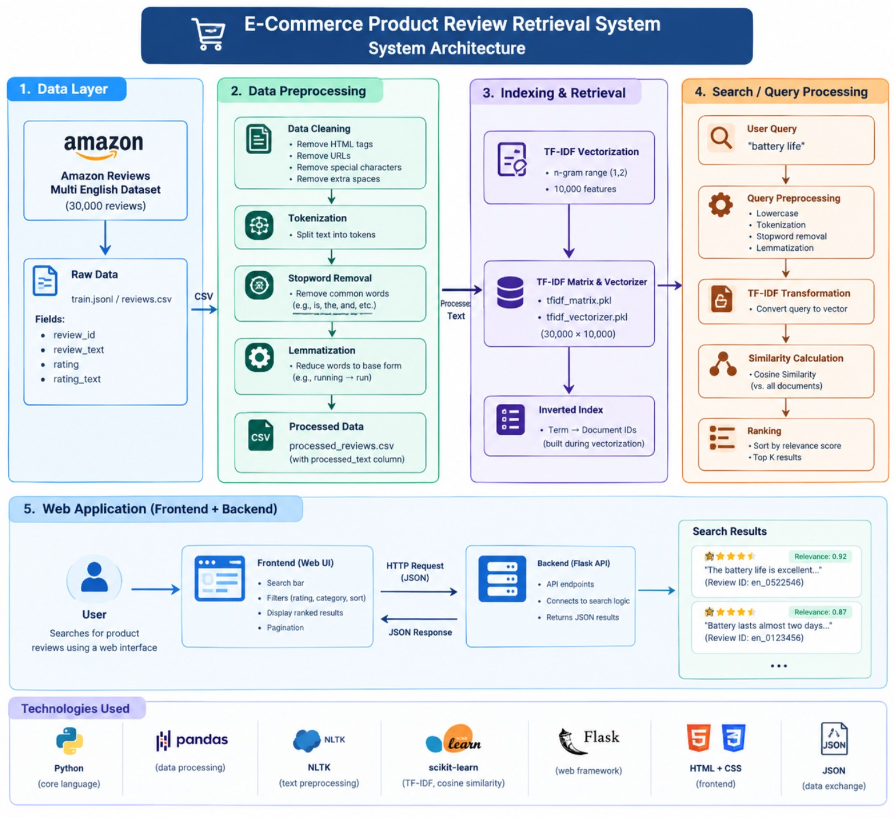

# E-Commerce Product Review Retrieval System

An Information Retrieval (IR) system for searching and retrieving relevant e-commerce product reviews using **TF-IDF vectorization and Cosine Similarity**. The system processes a collection of 30,000 Amazon product reviews, indexes the processed text, and retrieves the most relevant reviews for a user's search query through a web-based interface.

---

## 📌 Project Overview

The **E-Commerce Product Review Retrieval System** is designed to help users quickly find relevant product reviews from a large collection of reviews.

Instead of manually going through thousands of reviews, users can enter a natural-language search query such as:

* `battery life`
* `camera quality`
* `sound quality`
* `delivery`
* `product quality`

The system preprocesses the query, converts it into a TF-IDF vector, compares it with the indexed review collection using **Cosine Similarity**, and ranks the reviews according to their relevance.

The system displays the **Top 10 most relevant reviews** along with their rating, review ID, and relevance score.

---

# 🎯 Objectives

The main objectives of the project are:

1. To develop an Information Retrieval system for e-commerce product reviews.
2. To process and clean a large collection of product reviews.
3. To apply NLP-based text preprocessing techniques.
4. To represent reviews using TF-IDF.
5. To retrieve relevant reviews using Cosine Similarity.
6. To rank retrieved reviews according to their relevance.
7. To provide a simple and user-friendly web interface.
8. To provide rating-based filtering and result sorting.
9. To evaluate the retrieval performance using IR evaluation metrics.

---
## 🏗️ System Architecture

The E-Commerce Product Review Retrieval System follows a layered architecture consisting of data collection, text preprocessing, TF-IDF indexing and retrieval, query processing, and a Flask-based web application.



### Architecture Components

1. **Data Layer**
   - Uses the Amazon Reviews Multi English Dataset.
   - The current project uses 30,000 product reviews.
   - Review information includes review ID, review text, rating, and rating text.

2. **Data Preprocessing**
   - HTML and URL removal
   - Special-character removal
   - Extra-space normalization
   - Tokenization
   - Stopword removal
   - Lemmatization
   - Generates the processed review dataset.

3. **Indexing and Retrieval**
   - TF-IDF vectorization is applied to the processed reviews.
   - Uses unigram and bigram features.
   - The TF-IDF representation contains 10,000 features.
   - The resulting TF-IDF matrix contains 30,000 review vectors.
   - Cosine similarity is used to measure similarity between the query and reviews.

4. **Search / Query Processing**
   - The user enters a search query.
   - The query undergoes the same preprocessing steps as the reviews.
   - The processed query is transformed using the trained TF-IDF vectorizer.
   - Cosine similarity is calculated against the review collection.
   - Reviews are ranked according to their relevance score.
   - The top 10 relevant reviews are displayed.

5. **Web Application**
   - The frontend provides the search interface and result display.
   - The Flask backend connects the web interface with the retrieval system.
   - Users can filter results by rating and sort results by relevance or rating.
   - Search results are returned to the frontend in JSON format.


# 🔄 System Workflow

The system follows the following workflow:

```text
Dataset
   ↓
Data Cleaning
   ↓
Text Preprocessing
   ↓
TF-IDF Feature Extraction
   ↓
TF-IDF Matrix Generation
   ↓
User Query
   ↓
Query Preprocessing
   ↓
Query Vectorization
   ↓
Cosine Similarity
   ↓
Ranking
   ↓
Top 10 Results
   ↓
Display Results
```

---

# 📂 Project Structure

```text
ecommerce-review-ir-main/
│
├── data/
│   ├── train.jsonl
│   ├── reviews.csv
│   ├── processed_reviews.csv
│   ├── tfidf_matrix.pkl
│   └── tfidf_vectorizer.pkl
│
├── src/
│   ├── download_dataset.py
│   ├── preprocess.py
│   ├── build_index.py
│   └── search.py
│
├── templates/
│   └── index.html
│
├── static/
│   ├── style.css
│   └── script.js
│
├── app.py
├── requirements.txt
└── README.md
```

---

# 📊 Dataset

The project uses the **Amazon Reviews Multi English** dataset.

For the current implementation, a collection of **30,000 reviews** is used.

The main review data contains:

| Field         | Description                     |
| ------------- | ------------------------------- |
| `review_id`   | Unique identifier of the review |
| `review_text` | Original review text            |
| `rating`      | Numerical rating                |
| `rating_text` | Text representation of rating   |

After preprocessing, the following additional field is generated:

| Field            | Description                        |
| ---------------- | ---------------------------------- |
| `processed_text` | Cleaned and normalized review text |

---

# 🧹 Text Preprocessing

Before indexing, the review text is cleaned and normalized.

The preprocessing pipeline includes:

### 1. Lowercasing

All text is converted to lowercase.

Example:

```text
"Battery Life Is Excellent"
```

becomes:

```text
"battery life is excellent"
```

### 2. HTML Removal

HTML elements are removed from the review text.

### 3. URL Removal

URLs and web addresses are removed.

### 4. Special Character Removal

Unnecessary special characters and symbols are removed.

### 5. Whitespace Normalization

Extra spaces are removed.

### 6. Tokenization

The review is divided into individual words/tokens.

### 7. Stopword Removal

Common words that provide little retrieval value are removed.

Examples:

```text
the
is
a
an
and
```

### 8. Lemmatization

Words are converted into their base form where applicable.

This preprocessing is also applied to the user's search query so that the query and reviews use a consistent representation.

---

# 🔎 Information Retrieval Method

## TF-IDF

The system uses **Term Frequency-Inverse Document Frequency (TF-IDF)** to represent reviews numerically.

TF-IDF gives higher importance to words that are:

* frequent in a particular document
* less common across the entire document collection

The implementation uses:

```text
ngram_range = (1, 2)
```

Therefore, both **unigrams and bigrams** are considered.

For example:

```text
battery
life
battery life
```

can be represented as features.

The current TF-IDF representation contains:

```text
30,000 documents
×
10,000 features
```

---

# 📐 Cosine Similarity

After preprocessing the user's query, the query is converted into a TF-IDF vector.

The system compares the query vector with the TF-IDF vectors of the reviews using **Cosine Similarity**.

The similarity value indicates how closely a review matches the query.

Conceptually:

```text
Higher Cosine Similarity
        ↓
More Relevant Review
```

The reviews are then sorted in descending order of similarity.

---

# 🏆 Result Ranking

The system evaluates the query against the available review collection and ranks matching reviews according to their similarity score.

The web application displays the **Top 10 results**.

Each result contains:

```text
Result Rank
Review Text
Rating
Review ID
Relevance Score
```

Example:

```text
Result #1
Relevance: 78.29%

"The battery life is not very long."

⭐ 1/5
Review ID: en_0805027
```

---

# 🌐 Web Application

The project uses **Flask** to provide a web-based interface.

The web application allows users to:

* Enter a search query
* Retrieve relevant reviews
* View relevance scores
* View review ratings
* View review IDs
* Filter results by rating
* Sort results by relevance
* Sort results by rating

---

# 🎛️ Available Filters

## Rating Filter

Users can filter retrieved reviews according to their rating:

```text
All Ratings
5 Stars
4 Stars
3 Stars
2 Stars
1 Star
```

## Sorting

The results can be sorted by:

```text
Relevance
Rating
```

The default sorting method is **Relevance**.

---

# 🧪 Example Queries

The following queries can be used to test the system:

```text
battery life
camera quality
sound quality
delivery
product quality
comfortable
```

Example:

```text
User Query:
battery life

        ↓

Query Preprocessing

        ↓

TF-IDF Query Vector

        ↓

Cosine Similarity

        ↓

Ranking

        ↓

Top 10 Relevant Reviews
```

---

# 📈 IR Evaluation

The retrieval system was evaluated using manually judged test queries.

For each query, the Top 10 retrieved reviews were inspected and classified as relevant or not relevant to the query.

The primary metric used is:

## Precision@10

Precision@10 measures how many of the Top 10 retrieved documents are relevant.

```text
Precision@10 =
Relevant documents in Top 10
--------------------------------
             10
```

Five test queries were used:

| Query           | Precision@10 |
| --------------- | -----------: |
| Battery life    |         100% |
| Camera quality  |          50% |
| Sound quality   |         100% |
| Delivery        |         100% |
| Product quality |         100% |
| **Average**     |      **90%** |

The evaluation is based on manual relevance judgments of the retrieved results.

> Note: Precision@10 should not be referred to as overall "accuracy". It specifically measures the precision of the Top 10 retrieved results.

---

# 🛠️ Technologies Used

| Technology   | Purpose                                |
| ------------ | -------------------------------------- |
| Python       | Core programming                       |
| Flask        | Web backend                            |
| Pandas       | Dataset processing                     |
| NLTK         | NLP preprocessing                      |
| Scikit-learn | TF-IDF and Cosine Similarity           |
| Joblib       | Saving/loading trained TF-IDF objects  |
| HTML         | Web page structure                     |
| CSS          | Web page styling                       |
| JavaScript   | Frontend interaction                   |
| Git/GitHub   | Version control and project management |

---

# 📦 Installation

## 1. Clone the Repository

```bash
git clone <YOUR_GITHUB_REPOSITORY_URL>
```

Move into the project directory:

```bash
cd ecommerce-review-ir-main
```

---

## 2. Create a Virtual Environment

### Windows

```bash
python -m venv venv
```

Activate it:

```bash
venv\Scripts\activate
```

### macOS/Linux

```bash
python3 -m venv venv
```

Activate it:

```bash
source venv/bin/activate
```

---

## 3. Install Dependencies

```bash
pip install -r requirements.txt
```

---

# 📚 NLTK Resources

The project uses NLTK resources required for stopword removal and lemmatization.

If they are not already installed, run Python and download the required resources:

```python
import nltk

nltk.download('stopwords')
nltk.download('wordnet')
nltk.download('omw-1.4')
```

---

# ▶️ Running the Application

Start the Flask application:

```bash
python app.py
```

The terminal should display a local address similar to:

```text
http://127.0.0.1:5000
```

Open this address in a web browser.

---

# 🔍 How to Use

### Step 1

Open the web application.

### Step 2

Enter a search query.

Example:

```text
battery life
```

### Step 3

Click **Search**.

### Step 4

The system preprocesses the query and calculates its similarity with the indexed reviews.

### Step 5

The Top 10 relevant reviews are displayed.

### Step 6

Use the rating filter or sorting option if required.

---

# 📁 Important Files

### `app.py`

Main Flask application.

Responsible for:

* Loading review data
* Loading TF-IDF objects
* Query preprocessing
* Cosine similarity calculation
* Ranking results
* Rating filtering
* Sorting
* Providing search results to the frontend

### `src/preprocess.py`

Responsible for preprocessing the review dataset.

### `src/build_index.py`

Responsible for creating the TF-IDF representation/index used by the retrieval system.

### `src/search.py`

Provides the command-line retrieval implementation and demonstrates the core search functionality.

### `templates/index.html`

Contains the structure of the web interface.

### `static/style.css`

Contains the styling of the web interface.

### `static/script.js`

Handles frontend search requests and displays the retrieved results.

---

# 💡 Advantages

* Efficient retrieval from a large review collection.
* Simple and understandable IR methodology.
* Uses established NLP preprocessing techniques.
* Uses TF-IDF for effective text representation.
* Uses Cosine Similarity for relevance calculation.
* Provides ranked search results.
* Supports Top-10 review retrieval.
* Provides rating filtering.
* Provides relevance and rating-based sorting.
* Easy to run locally.
* Web-based user interface.

---

# ⚠️ Limitations

1. The current retrieval approach is primarily based on lexical similarity.
2. TF-IDF may not fully understand semantic relationships between words.
3. Synonyms with different words may not always be retrieved effectively.
4. The evaluation uses manually judged queries and a limited test-query set.
5. Recall and F1-score require a clearly defined complete relevance set and are not currently reported.
6. The current dataset contains review-level information rather than a complete product catalog.

---

# 🔮 Future Scope

The system can be extended in the future with:

* Semantic search using word embeddings.
* Transformer-based retrieval models.
* BM25 comparison with TF-IDF.
* Relevance feedback.
* Query expansion.
* Advanced ranking algorithms.
* Larger review collections.
* More detailed product metadata.
* Pagination or "Load More" functionality.
* More extensive automated IR evaluation.

---

# 👥 Project Type

**Domain:** Information Retrieval / Natural Language Processing

**Project:** E-Commerce Product Review Retrieval System

**Retrieval Technique:** TF-IDF + Cosine Similarity

**Dataset:** Amazon Reviews Multi English

**Dataset Size:** 30,000 reviews

**Web Framework:** Flask

**Frontend:** HTML, CSS, JavaScript

---

# 📌 Conclusion

The E-Commerce Product Review Retrieval System provides a practical Information Retrieval solution for searching a large collection of product reviews.

The system preprocesses review text, represents documents using TF-IDF, processes user queries using the same preprocessing pipeline, calculates Cosine Similarity between the query and review collection, and ranks the retrieved reviews according to their relevance.

The web interface allows users to search the review collection and view the Top 10 relevant reviews along with their ratings, review IDs, and relevance scores. The system also provides rating-based filtering and result sorting.

Based on the current manual evaluation of five test queries, the system achieved an average **Precision@10 of approximately 90%**, demonstrating effective retrieval for the selected test queries.

---

# 📚 References

1. Amazon Reviews Multi English Dataset.
2. Scikit-learn documentation for TF-IDF and Cosine Similarity.
3. NLTK documentation for Natural Language Processing.
4. Flask documentation for web application development.
5. Standard Information Retrieval literature covering TF-IDF, vector space models, and Cosine Similarity.
